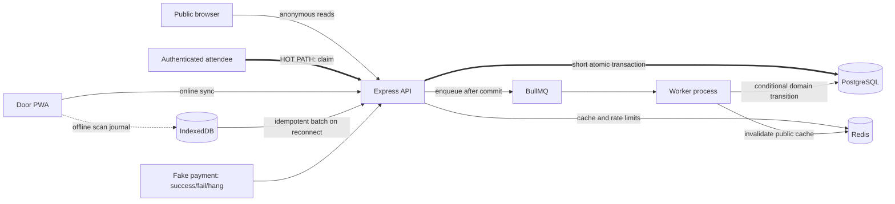

# Gate system design

- Status: Proposed and kept current by the team
- Last updated: 3 September 2026

## One-page view

The bold path is the ticket-claim hot path. PostgreSQL, not Redis or BullMQ, decides whether capacity remains. The payment call occurs after the short reservation transaction commits.

## Source-of-truth boundaries

| Concern                                             | Authority                               |
| --------------------------------------------------- | --------------------------------------- |
| Events, inventory, reservations, tickets, check-ins | PostgreSQL                              |
| Public event acceleration                           | Redis cache                             |
| Background delivery                                 | BullMQ                                  |
| Offline pending scans                               | Door PWA IndexedDB until reconciliation |
| Authentication claims                               | Server-issued JWT validated by API      |

## Critical invariants

- An event never has more sold/reserved inventory than capacity.
- Creating a reservation and reserving inventory are one database transaction.
- Only one conditional transition can confirm, fail, or expire a pending reservation.
- A real ticket exists only after successful confirmation.
- A ticket is admitted at most once; replayed offline scans return the prior result.
- The PWA stores verification/public material, never a server signing secret.

## Cross-slice boundary

Inventory owns claim correctness. Platform owns authentication, traffic controls, queue runtime, deployment, logs, and metrics. Events and console owns event publication/read services and their cache contract. Public browse owns the anonymous API/surface. Check-in owns the online/offline check-in contract and chairs the contract review.

## AI disclosure

AI helped convert the team canvas into this draft. The team must confirm the diagram matches the implemented system after every material change.
